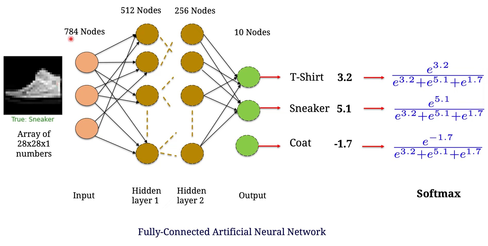
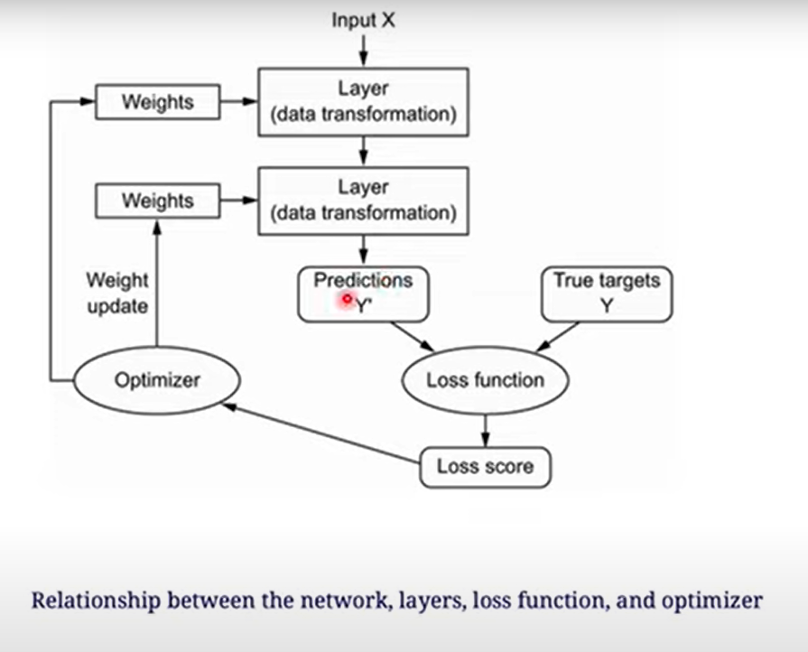
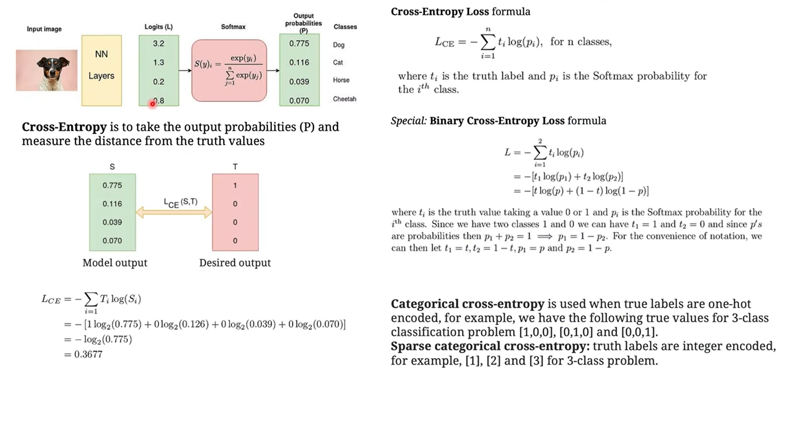

# ANN

### Fully-connected Artificial Neural Network

1. Input image => Input layers

   - Array of 28x28x1 numbers represent for the input image
   - This image is `flattened` into input layers with 784 nodes
   - Each input node is corresponding for each pixel on the image

2. Input layers => Hidden layers 1 **Data Transformation 1**

   - Each node in "hidden layers 1" receive input from 784 input layers by the function `y = ax + b` called `linear mapping`
   - 784 inputs return 512 hidden layer node

3. Hidden layers 1 => Hidden layers 2 **Data Transformation 1**

   - 512 layers_1 nodes connect to `activations function` (in this case is `"relu" function`)

   - 256 layer_2 nodes receive input from 512 layer_1 nodes with `linear mapping`

4. Hidden layer 2 => output
   - number of output layers = the target number of class that you want to classification (in this case the number = 10)
   - each node represent for each label

`softmax`: the result to the vector of numbers which are in `[0, 1] => (%)` and sum of all number in vector is equal to 1

### Relationship between `the network`, `layers`, `loss function` and `optimizer`

- `loss function` = "categorical_crossentropy"
  - the **loss** is the quatity that you'll attempt to minimize during training, so it reprsent a measure of success for the task you are trying to solve

## Calculate the `loss score` through the `loss function`

**Cross Entropy**

**overfitting**: train model trên tập training datset quá nhiều dẫn đến overfitting trên tập validation => val_loss có xu hướng tăng

- fix: define lại model để xóa đi các lịch sử training => compile lại hoặc đổi batch_size

## Loss function

1. how to calculate `loss function`
2. how to update weight while they are trained
3. how to add `loss fucntion` and `optimizer` to the model
4. train the ANN
5. model evaluation: analys the **accuracy** of the model in the testing and validation dataset

# Question

1. Why the number of hidden layer 1 is 512 and hidden layer 2 is 256
2. What is activation function? What is "relu" meaning?
